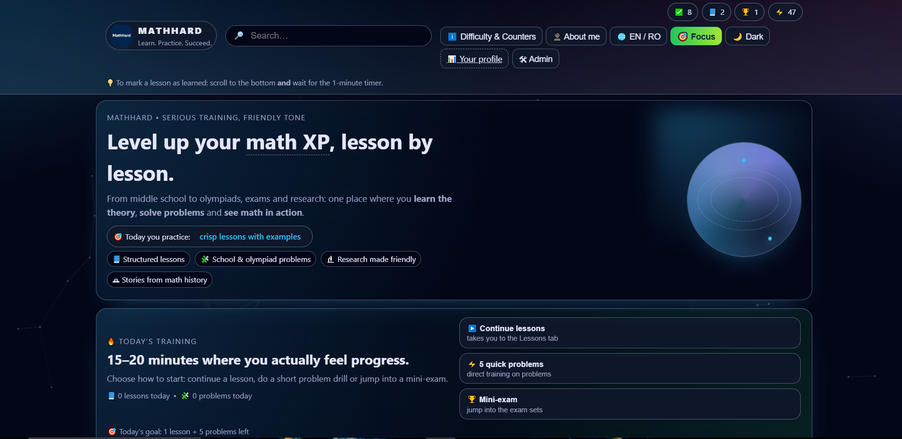
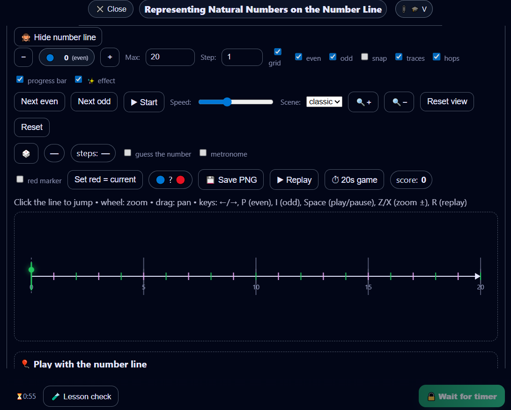

# MathHard

> Interactive mathematics learning platform built to make math feel like progression, not punishment.  
> Learn theory, solve problems, earn XP, track progress, take exams, and move from school fundamentals to olympiad, admissions, and advanced topics.

## Live Demo

**Try it here:**  
https://mathhard.netlify.app/

---

## Overview

**MathHard** is a modern web-based math learning platform designed as a complete system, not just a collection of pages and exercises.

It combines:

- structured lessons
- guided problem-solving
- XP-based progression
- user profiles and progress tracking
- timed exam simulations
- olympiad and advanced math content
- admin-side content management
- bilingual educational experience (RO / EN)

The goal is simple: make mathematics feel more motivating, more organized, and more alive.

---

## Screenshots

---

## Why MathHard stands out

Most student math websites stop at static theory pages and a few exercises.

MathHard goes further by adding real product structure:

- **auth + profile logic**
- **persistent user progress**
- **XP and learning counters**
- **exam workflows with timing and scoring**
- **content architecture for lessons, problems, and exams**
- **admin-side scaling through Supabase-backed content flow**

This makes MathHard feel closer to a real educational product than a simple school project.

---

## Main Features

### Learning System
- Structured lessons from foundational to advanced topics
- Clear chapter-based progression
- Lesson completion flow designed to encourage real learning

### Problem-Solving System
- Practice problems linked to lessons
- Difficulty-based exploration
- Instant answer checking
- Progressive learning logic across categories

### XP & Progress Tracking
- XP-based motivation
- Counters for solved problems, learned lessons, and passed exams
- Profile page with user progress summary

### Exam Mode
- Timed exams
- EN / BAC / admission-style sections
- Open-answer and multiple-choice support
- Scoring profiles for different exam styles

### Advanced Math Content
- Olympiad-oriented material
- Research / faculty-level topics
- History of mathematics for broader mathematical culture

### Platform Experience
- Romanian / English support
- Focus Mode
- Clean UI
- Admin panel
- Supabase-backed data flow

---

## Sections Inside the Platform

- **Lessons**
- **Problems**
- **Exams**
- **XP / Progress**
- **Research**
- **History of Mathematics**
- **Profile**
- **Admin**

---

## Tech Stack

MathHard is built with:

- **HTML**
- **CSS**
- **JavaScript**
- **Supabase**
- **Netlify**
- **KaTeX**

It combines front-end product design, educational structure, and persistent user logic in a single platform.

---

## Product Direction

MathHard is designed around one core belief:

> mathematics should feel challenging, but never lifeless.

The platform is meant to help students:

- build fundamentals
- train consistently
- see measurable progress
- prepare for real exams
- explore harder material
- develop curiosity for deeper mathematics

---

## Roadmap

Planned directions for future development:

- richer progress analytics
- stronger lesson-specific quizzes
- smarter answer validation
- more advanced exam authoring
- adaptive recommendations based on progress
- expanded advanced / olympiad material

---

## Project Status

MathHard is actively being developed and expanded.

Current focus areas include:
- content growth
- exam system improvements
- better progress logic
- stronger admin workflows
- improved learning analytics

---

## Author

**Gabor Cristian-Daniel**  
Student builder, math enthusiast, and creator of MathHard.

MathHard reflects both technical ambition and a genuine interest in making mathematics more engaging, structured, and meaningful for students.
