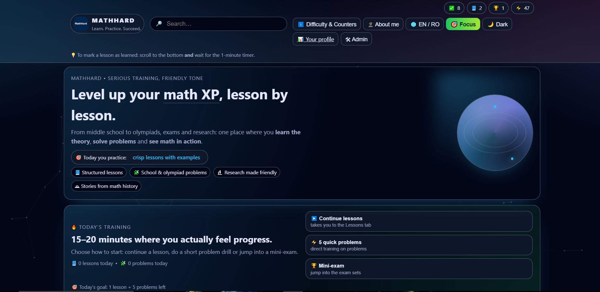
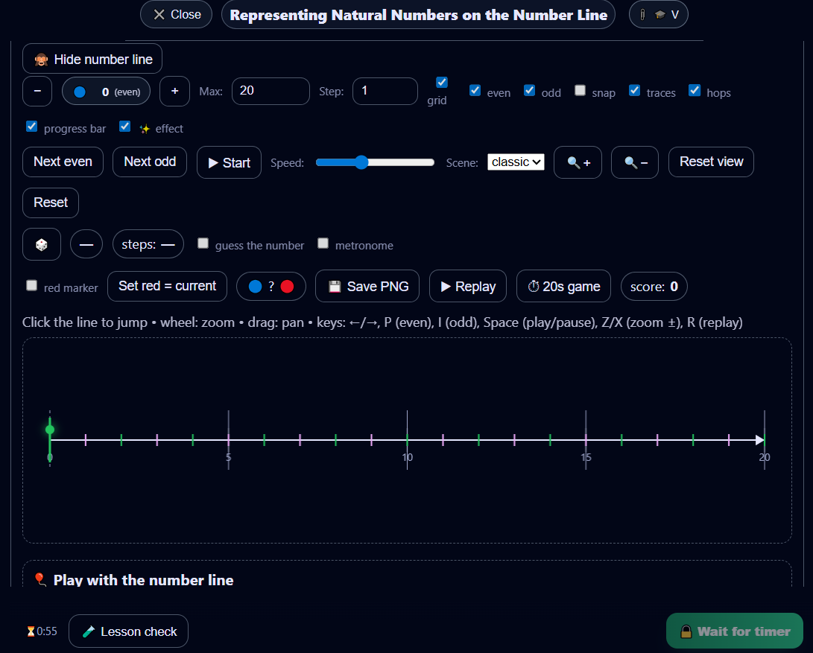

# MathHard

> A bilingual mathematics learning platform built around structured learning, real progress, and long-term mathematical growth.

[](https://mathhard.app/)
[]()
[]()
[]()

## Overview

**MathHard** is an educational platform for learning mathematics through a connected system of lessons, problems, quizzes, exams, concepts, roadmaps, progress tracking, and analytics.

The project is designed to cover a wide mathematical path:

**middle school → high school → national exams → university admissions → olympiad → university mathematics → research topics**

Instead of treating content as isolated pages, MathHard connects learning material through prerequisites, concept mappings, progress states, assessments, and study paths.

The platform is available in **Romanian and English**.

## Live Platform

**https://mathhard.app/**

## Screenshots





---

## What MathHard Includes

### Lessons

- Structured bilingual lessons
- Chapter and grade organization
- Examples and mathematical notation rendered with KaTeX
- Read / learned progress states
- Lesson-specific concept mappings
- Five-question lesson checks across the current lesson catalogue

### Problems

- Practice problems linked to lessons
- Difficulty and curriculum metadata
- Answer checking and attempt tracking
- Progressive hints and explanations where available
- Separate progress states for opened, attempted, and solved problems

### Lesson Quizzes

Each current lesson has its own assessment layer.

The quiz system supports:

- Romanian / English prompts
- multiple-choice questions
- explanations
- randomized questions and options
- publication state
- completion tracking

### Exam Mode

MathHard includes timed exam workflows for areas such as:

- Evaluarea Națională
- Bacalaureat
- university admission
- custom mathematical assessments

Exam content uses an **independent item bank**. Practice problems are not reused directly as exam questions.

This separation keeps practice and assessment logically independent and makes future exam generation safer and easier to scale.

### Concept Layer

MathHard models mathematics as a network of concepts rather than only a list of lessons.

The concept system includes:

- canonical mathematical concepts
- prerequisite relationships
- lesson / problem / exam mappings
- primary and supporting concepts
- concept coverage
- mastery-related analytics
- retention and review foundations

This allows the platform to reason about *what a student knows*, not only which page they opened.

### Study Roadmaps

Roadmaps organize content into guided preparation paths.

They can connect:

- lessons
- problems
- exams
- milestones
- prerequisites

The current architecture supports roadmap validation and admin-side ordering, with planned expansion for admission-specific study paths.

### Progress & Analytics

MathHard tracks learning activity across multiple dimensions:

- lessons read
- lessons learned
- problems opened
- problems attempted
- problems solved
- exams passed
- XP
- concept evidence
- retention signals

The analytics layer is designed to evolve toward stronger personalized recommendations and data-driven learning decisions.

### Gamification

The platform includes systems for:

- XP
- levels
- achievements / badges
- daily goals
- weekly challenges
- progress counters
- reward-oriented learning feedback

Gamification is used to support consistency rather than replace academic progress.

### Profiles & Community

MathHard contains foundations for a broader learning community:

- user profiles
- optional public profiles
- regional / global leaderboard infrastructure
- badges
- privacy controls
- reporting and moderation tools
- feedback flows

Community features are built with opt-in and moderation requirements in mind.

### Admin Studio

The Admin area is a real content-management environment rather than a collection of hard-coded forms.

It includes tooling for:

- lessons
- problems
- exams
- concepts
- roadmaps
- quizzes
- editorial quality
- publication workflow
- batch content import
- templates
- history and recovery
- gamification
- community moderation

Admin functionality is loaded separately from the main student experience where possible.

---

## Current Content Snapshot

As of **August 2026**, the live database contains:

| Content | Count |
|---|---:|
| Lessons | 48 |
| Problems | 170 |
| Exams | 5 |
| Concepts | 85 |
| Concept prerequisite edges | 61 |
| Concept mappings | 309 |
| Lesson quizzes | 48 |
| Lesson quiz items | 240 |

Every current lesson has a lesson quiz, and the current editorial audit reports complete quality-metadata coverage for lessons, problems, and exams.

The content catalogue is still expanding; these numbers describe the current development snapshot, not the intended final scope.

---

## Mathematics Scope

MathHard is being built to support multiple levels of mathematics in one system.

Current and planned areas include:

- Grades V–VIII
- Grades IX–XII
- Evaluarea Națională
- Bacalaureat
- university admission
- olympiad mathematics
- linear algebra
- mathematical analysis
- complex analysis
- functional analysis
- number theory
- topology
- geometry
- combinatorics
- mathematical research topics
- history of mathematics

The long-term goal is not simply to store more content, but to connect it into meaningful learning paths.

---

## Tech Stack

### Frontend

- **HTML**
- **CSS**
- **JavaScript (ES modules)**
- **KaTeX**

The application intentionally uses a modular browser-based architecture without requiring a large frontend framework for the core runtime.

### Backend

- **Supabase**
  - Authentication
  - PostgreSQL
  - Row Level Security
  - RPC functions
  - content persistence
  - progress persistence

### Deployment

- **Netlify**
- production domain: **mathhard.app**

The build process produces a dedicated static runtime directory for deployment.

---

## Architecture

The project is split into focused runtime modules for areas such as:

- authentication
- content repositories
- lesson status
- quizzes
- secure problem / exam flows
- concepts
- roadmaps
- progress
- analytics
- gamification
- community
- admin tooling

Content loading is centralized through the repository layer instead of being scattered across UI components.

Admin-heavy functionality is progressively isolated and lazy-loaded to keep the student runtime smaller.

---

## Content Integrity Principles

MathHard follows several rules intended to keep the learning system academically coherent.

### Practice and exams are separate

A normal practice problem is not reused as an exam item.

Exam banks use independent embedded questions so practice exposure does not automatically reveal assessment content.

### Concepts are canonical

Lessons and problems map to reusable mathematical concepts instead of creating duplicate conceptual definitions for each page.

### Prerequisites are explicit

Concept relationships can encode required prerequisite knowledge, allowing roadmaps and analytics to reason about dependency structure.

### Bilingual content is part of the model

Romanian and English content is handled as part of the content architecture, not as an afterthought in the UI.

### Publication is controlled

Content can have separate editorial quality and publication states, allowing material to exist as a draft before being considered ready for students.

---

## Security Model

- Authentication is handled by **Supabase Auth**.
- Admin permissions are derived from the database role model.
- Content and progress writes are protected through **Row Level Security** and controlled RPC functions.
- The browser uses only the Supabase **publishable key**.
- Secret / `service_role` credentials must never be placed in frontend files.
- Legacy PHP authentication and JSON content endpoints are no longer part of the runtime architecture.
- Admin functionality is verified independently from normal authenticated-user behavior.
- Database security is also reviewed separately from static frontend audits.

Security and anti-cheat are treated as ongoing engineering concerns, especially for competitive or ranking-sensitive features.

---

## Quality & Release Checks

MathHard has an automated release gate covering areas such as:

- runtime contracts
- repository behavior
- localization
- security
- performance
- content authoring
- publication workflow
- concept coverage
- concept mastery / retention
- exam independence
- community safety
- responsive UI
- stability

The project is built with:

```bash
npm test
npm run build
```

The Netlify build runs the release checks before producing the deployable site.

---

## Product Direction

MathHard is built around a simple idea:

> **Mathematics should be difficult because the ideas are deep — not because the learning experience is disorganized.**

The platform aims to help students:

- understand theory
- practise consistently
- identify weak areas
- measure real progress
- prepare for exams
- move into harder mathematics
- explore mathematical ideas beyond the school curriculum

---

## Roadmap

Near-term development focuses on:

- full product testing from Admin, authenticated-user, and visitor perspectives
- continued UI/runtime hardening
- expansion of university-admission content
- richer study roadmaps
- stronger personalized analytics
- concept-based recommendations
- broader olympiad and university content

Longer-term ideas include:

- adaptive learning recommendations
- predictive learning analytics
- deeper data-science models for student progress
- larger exam and admission banks
- richer mathematical visualizations and animations
- mobile / desktop application packaging
- expanded community and educational media integration

---

## Development Philosophy

MathHard started as a much smaller school project and has been rebuilt into a broader educational system.

The project is developed incrementally:

1. build the infrastructure,
2. test the data model,
3. repair legacy content,
4. validate integrity,
5. expand only after the foundations are stable.

That approach is intentional. The goal is to build something maintainable enough to keep growing for years rather than maximize the number of features as quickly as possible.

---

## Author

**Gabor Cristian-Daniel**

Student developer and creator of MathHard.

The project combines interests in:

- mathematics
- software engineering
- data science
- educational technology
- competitive mathematics
- learning analytics

MathHard is an ongoing long-term project and continues to evolve alongside its content, architecture, and educational goals.
